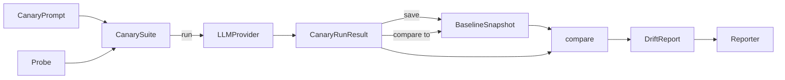

# Core Concepts Overview

PromptCanary is built from five composable pieces. Understanding how they
fit together makes the rest of the documentation — and the SDK — much
easier to navigate.

## CanaryPrompt

A single prompt with optional metadata: expected keywords, tags, a
description, and an optional per-prompt system prompt override. See
[CanarySuite](canary-suite.md#canaryprompt).

## Probe

A stateless, callable unit that scores one `(CanaryPrompt, LLMResponse)`
pair. Probes return a `ProbeResult` with a `passed` boolean and a `score`
between 0.0 and 1.0. See [Probes](probes.md).

## CanarySuite

Orchestrates a list of prompts against a list of probes and a provider.
Calling `suite.run(provider)` produces a `CanaryRunResult`. See
[CanarySuite](canary-suite.md).

## BaselineSnapshot

A saved, versioned copy of a `CanaryRunResult` — the "known good" state
that future runs are compared against. Stored as JSON via `FileBaselineStore`.
See [Baselines & Comparison](baselines.md).

## DriftReport

The output of `compare(baseline, current_run)`. Contains a per-probe,
per-prompt comparison, a derived severity rating (`NONE` through
`CRITICAL`), and a human-readable summary. See [Drift Reports](drift-reports.md).

## Design Principles

PromptCanary follows a small number of non-negotiable principles, documented
in full in the [Decision Log](../decision-log.md):

1. **Simplicity first** — most users never need to read the source.
2. **Pluggable everything** — providers, probes, and storage are all swappable.
3. **No silent failures** — a broken probe produces a failed `ProbeResult`,
   never an unhandled exception.
4. **Deterministic by default** — `temperature=0.0`, fixed `seed`.
5. **Reproducible storage** — baselines are plain JSON, diffable in git.
